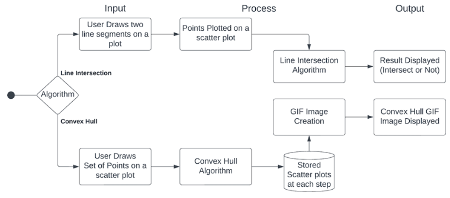

# Convex Hull and Line Intersection Algorithms

## Project Description
This repository implements fundamental computational geometry algorithms including:
- 5 convex hull algorithms (Quick Hull, Brute Force, Graham Scan, Jarvis March, Monotone Chain)
- 3 line intersection detection methods (CCW, Bounding Boxes, Cramer's Rule)

Each algorithm features:
- Interactive visualization
- Time/space complexity analysis
- Animated GIF demonstrations
- Multiple input methods (GUI plotting and random generation)

## Architecture


## Algorithms Implemented

### Convex Hull Algorithms
1. **Quick Hull** - O(n log n) average case
2. **Brute Force** - O(n³) 
3. **Graham Scan** - O(n log n)
4. **Jarvis March** - O(nh) 
5. **Monotone Chain** - O(n log n)

### Line Intersection Methods
1. **Counter-Clockwise (CCW)** Orientation Test
2. **Bounding Box** Intersection Detection  
3. **Cramer's Rule** for exact intersection points

## Features
- Interactive Tkinter GUI for point input
- Matplotlib visualizations
- Step-by-step algorithm animation
- Complexity analysis display
- Desktop GIF generation
- Cross-platform compatibility

## Installation
```bash
git clone https://github.com/Jatin-Kesnani/Convex-Hull-and-Line-Intersection-Algorithms.git
```
